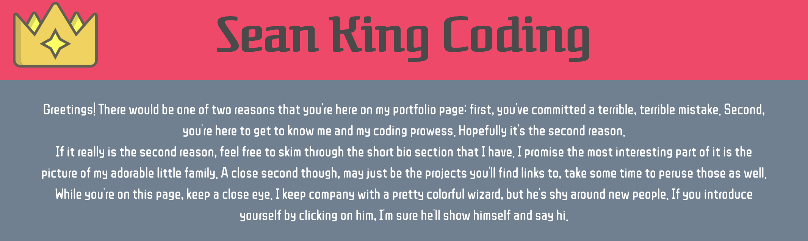
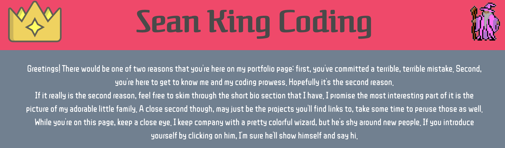
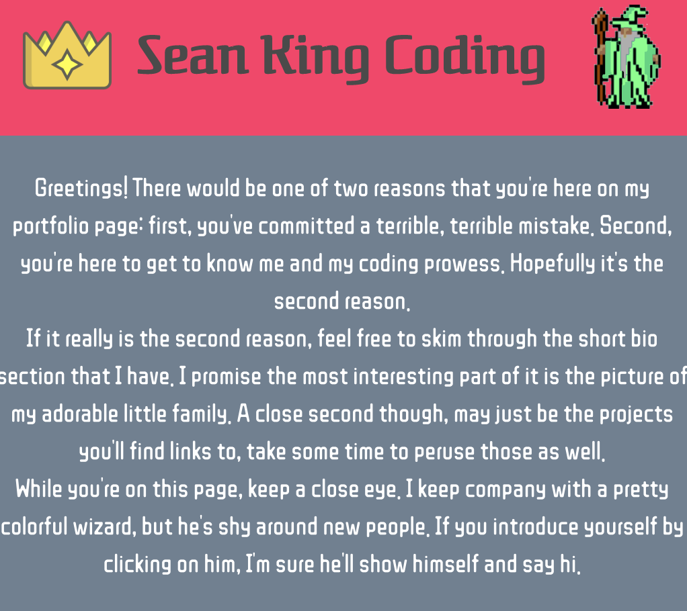
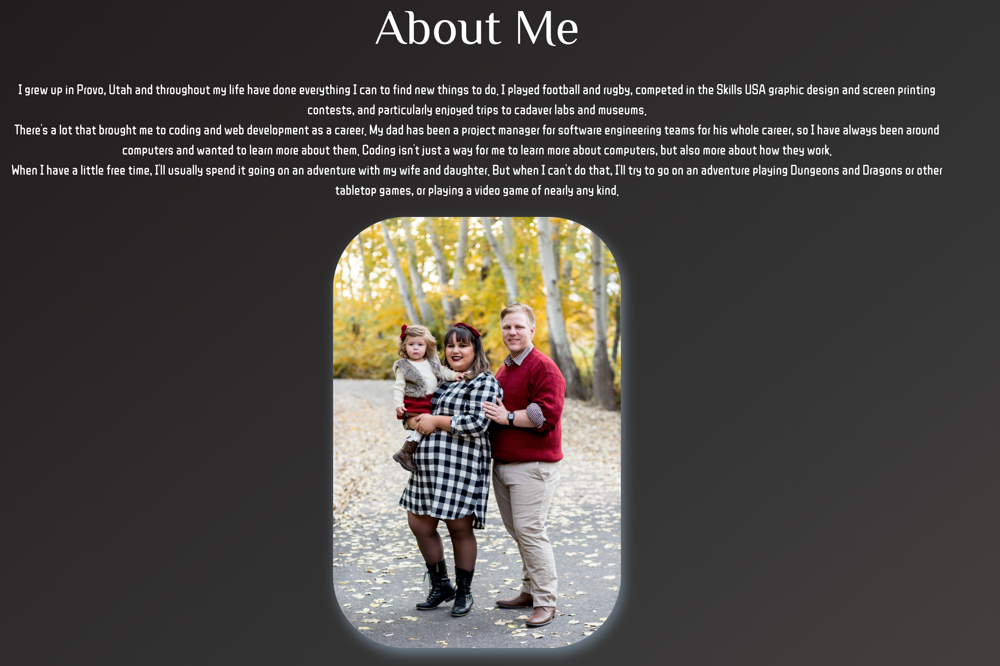
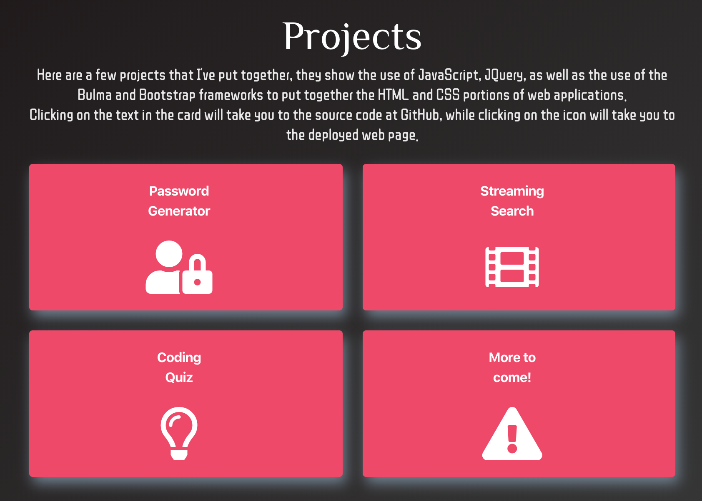

# Professional Portfolio

### Link to the deployed site

https://seanianking.github.io/UpdatedPortfolio/index.html

## Contents

This is a pair of pictures from the top area of the portfolio page. The red banner at the top of the page has a secret hiding in it.
Without the secret:

With the secret:

A simple formula was used to calculate the font size of the section headers based off of the size of the viewport.

A screenshot of the biography section, telling a little bit of my story and showing off a picture of my adorable family. There's a simple effect to give a light shadow to the picture, just to emphasize how adorable they really are.

And finally, here is what the project section, and the contact section look like. The project section is built in such a way that it will be easy to add more cards for future projects into the section.

